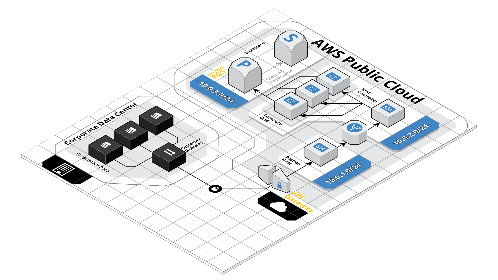

# Terraform visualization tools

## [Cloudcraft](https://www.cloudcraft.co/)

Pros:

- Produces great looking designs, its 3D designs are game changers IMO
- Switch between 2D and 3D views seamlessly
- Import your existing infrastructure syncing directly your AWS accounts (not available in the free version)
- Design and budget interactively
- Convert your AWS diagrams to Terraform code using [modules.tf](https://modules.tf/)

Cons:

- Limited catalog of pre-built objects (surely this will only grow further)
- Infra imports (AWS Live syncs) requires paid subscription
- Free users have a limited grid size, which is quite small **(Deal breaker)**
- Typical operations such as resizing and alignment are either buggy or not available at all

**Veredict:** For free users, the limited grid size is a massive deal breaker as any resources drawn outside of the grid won't be exported, and as resizing objects is not a valid option there is no way to fit entire architectures for most use cases. The cheapest subscription option is substantially priced for a tool that is considerably incomplete and lacking a lot of features. As this tool matures and its components catalog grows so it will its attractiveness, specially if the team rethinks its business model, but as of now they're just trying to commercialize an enthusiastic tool at enterprise prices.